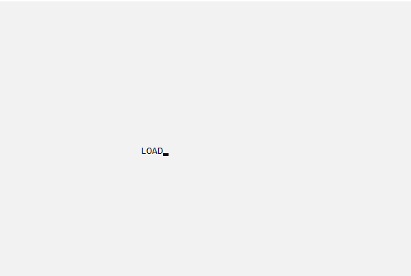
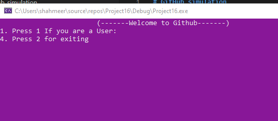
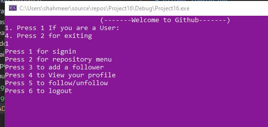
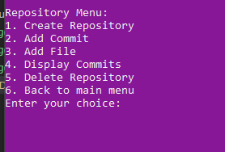

# GitHub_simulation

Visual Studio 2022:
Download and Install Visual Studio 2022:

Visit the official Visual Studio website (https://visualstudio.microsoft.com/) and download the Visual Studio 2022 installer.
Run the installer and select the "Desktop development with C++" workload during installation.
Create a New Project:

Open Visual Studio 2022.
Click on "Create a new project" and select a C++ project template that suits your needs, such as a console application.
Code and Extensions:

Start coding your project in the provided editor.
Explore extensions available within Visual Studio for additional functionalities specific to your project requirements.
VS Code:
Download and Install VS Code:

Visit the official VS Code website (https://code.visualstudio.com/) and download the installer for your operating system.
Install VS Code by following the installation instructions provided.
Install C++ Extension:

Open VS Code.
Navigate to the Extensions view by clicking on the square icon in the left sidebar or by pressing Ctrl+Shift+X.
Search for "C++" in the Extensions Marketplace.
Install the official C++ extension provided by Microsoft.

Github_Simulation Project Snapshots:
Loading console screen:

Welcome:

main menu:

Repository menu:

